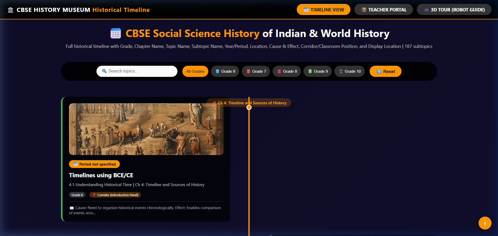
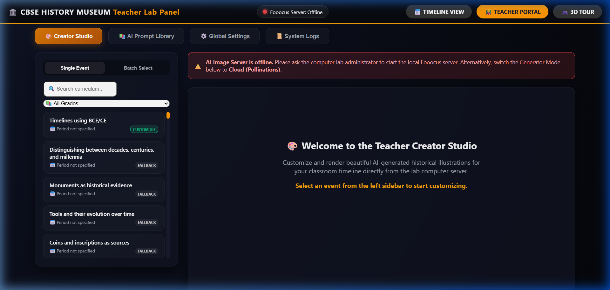
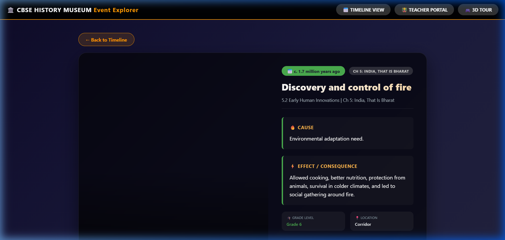
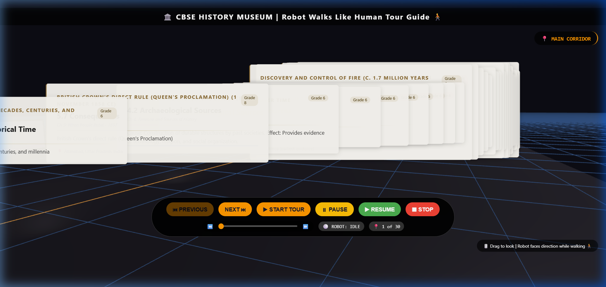

# 🏛️ CBSE School History Museum: AI-Powered Interactive Timeline

An interactive, high-fidelity digital museum timeline website designed to display historical events from the CBSE Social Science curriculum (Grades 6–10) with immersive visual storytelling. The project features an **AI Creator Studio**, content-based AI illustrations, unique sharing URLs, scannable QR codes, and a 3D virtual tour.

---

## 🚀 Key Features



1. **Interactive Timeline View (`index.html`)**:
   - Filter events dynamically by CBSE Grade Level (Grade 6 to 10) or search text content.
   - Beautiful responsive layouts with custom HSL-based color tokens corresponding to different historical eras.
2. **AI Creator Studio / Teacher Portal (`admin.html`)**:
   - **One-Click Generation**: Manually generate custom illustrations and animated GIFs for any historical event.
   - **Live status checking**: Automatically detects local AI server status (🟢 Online / 🔴 Offline) and shows helpful messages.
   - **AI Prompt Library**: Saves customizable prompt templates for all 187 CBSE curriculum events.
   - **Batch Mode**: Mass-generate illustrations and GIFs for multiple events with live progress status.



3. **15+ Custom Loop Animation Effects**:
   - Apply highly optimized, mathematically looped effects to images (e.g. fire burning, water flowing, flag waving, birds flying, screen-shake explosion) using a custom lightweight CPU-based Python rendering pipeline.
4. **Event Explorer Detail Page (`detail.html?id=ID`)**:
   - Deep-linking with unique URL query parameters for each event.
   - Structured sections highlighting historical **Cause & Effect** dynamics.
   


5. **Interactive 3D Virtual Tour (`3d.html`)**:
   - Enter a simulated virtual museum room with an automated robot tour guide navigating through historical display boards.
   


---

## 📁 Project Structure

* **`server.py`**: FastAPI server hosting REST APIs and serving frontend static files.
* **`backend/`**: Modular backend code:
  * `config.py`: Loads and saves global configurations.
  * `prompt_library.py`: Manages prompt templates for events.
  * `effects.py`: PIL & NumPy implementation of 15 loop animation effects.
  * `queue_manager.py`: FIFO background task queue, progress tracking, and retries.
  * `logger.py`: JSON logging system for requests, performance, and errors.
* **`index.html`** / **`timeline.js`** / **`timeline.css`**: Main timeline web application.
* **`admin.html`**: The teacher creator panel portal.
* **`detail.html`**: Detail view and QR code scan dialog.
* **`3d.html`** / **`3d.js`**: Interactive WebGL-based virtual museum tour space.

---

## 📖 Detailed Guides & Manuals

For step-by-step instructions on setting up, using, and maintaining the museum timeline:

1. 🛠️ **[Installation & LAN Setup Guide](docs/INSTALLATION_GUIDE.md)**: Installing Python, FastAPI, Fooocus, and making the server accessible over the school local network (LAN).
2. 👨‍🏫 **[Teacher Portal User Manual](docs/TEACHER_MANUAL.md)**: Working with Creator Studio, modifying prompts, applying animations, and running batch tasks.
3. ⚙️ **[Lab Administrator Guide](docs/ADMIN_GUIDE.md)**: Configuration parameters, troubleshooting, logs lookup, and database resets.
4. 🌐 **[REST API Reference](docs/API_DOCUMENTATION.md)**: Details on health endpoints, status polling, and generation routes.

---

## 🛠️ Quick Start

### 1. Initialize the Curriculum Database
```bash
python process_timeline.py
```

### 2. Launch the Museum Server
```bash
python server.py
```
Open your browser and navigate to:
* **Museum Timeline**: `http://localhost:8000/index.html`
* **Teacher Portal**: `http://localhost:8000/admin.html`

---

## 🎨 AI Image Generator: Fooocus Setup & Usage Guide

This project uses **[Fooocus](https://github.com/lllyasviel/Fooocus)** as its optional local AI image generation engine. Fooocus is a free, offline, open-source image generator built on Stable Diffusion XL. It produces **high-quality historical illustrations** with minimal configuration — perfect for school lab environments.

> **No manual prompt engineering needed.** Fooocus has a built-in GPT-2 prompt expansion engine that automatically enriches your prompts to produce beautiful results.

---

### 📋 Prerequisites

Before installing Fooocus, make sure the **lab server** computer meets these requirements:

| Requirement | Minimum | Recommended |
|---|---|---|
| **OS** | Windows 10 / Linux | Windows 11 / Linux |
| **GPU** | NVIDIA with 4 GB VRAM | NVIDIA RTX 3060+ with 6–8 GB VRAM |
| **RAM** | 8 GB | 16 GB |
| **Storage** | 20 GB free | 40 GB free |
| **Internet** | Required for first-time model download (~6.6 GB) | — |

> **No GPU?** You can still test the Teacher Portal by selecting **Pollinations (Cloud)** mode in `admin.html` — no local Fooocus needed at all.

---

### ⚙️ Step 1 — Download & Install Fooocus (Windows)

**Option A — One-Click Installer (Recommended for schools):**

1. Go to the [Fooocus Releases page](https://github.com/lllyasviel/Fooocus/releases) and download the latest `.7z` package:
   ```
   Fooocus_win64_2-5-0.7z  (or latest version)
   ```
2. Extract the `.7z` archive using [7-Zip](https://www.7-zip.org/) to a folder such as `C:\Fooocus`.
3. Inside the extracted folder, you will see `run.bat` and other files.

4. **Double-click `run.bat`** to launch Fooocus for the first time.

**Option B — Git Clone:**
```bash
git clone https://github.com/lllyasviel/Fooocus.git
cd Fooocus
```
Then run `run.bat` (Windows) or `python entry_with_update.py` (Linux/Mac).

---

### 🔄 Step 2 — First Launch & Automatic Model Download

When you run `run.bat` for the first time, Fooocus will:

1. **Create a Python virtual environment** and install all dependencies (PyTorch, Gradio, etc.) automatically.
2. **Download the SDXL checkpoint model** (~6.6 GB) to `Fooocus\models\checkpoints\`. This only happens once.
3. **Open your browser** automatically at `http://127.0.0.1:7865` once setup is complete.

> **Speed reference**: On a mid-range laptop (NVIDIA RTX 3060, 6 GB VRAM), Fooocus generates one image in approximately **1.35 seconds per iteration**. On school lab PCs with older GPUs, expect 5–15 seconds per image.

---

### 🖥️ Step 3 — Using the Fooocus Web Interface

After launch, your browser opens the Fooocus UI at `http://127.0.0.1:7865`.

**Key UI elements:**

| UI Area | What It Does |
|---|---|
| **Prompt box** (top-left) | Type your image description here (e.g., `ancient Indian classroom, Vedic era, children learning`) |
| **Negative Prompt** | Describe what to *exclude* from the image (e.g., `modern, cartoon, low quality`) |
| **Style selector** | Choose an art style preset — `Fooocus V2` gives the most realistic results |
| **Aspect Ratio** | Choose image dimensions. Use `4:3` or `3:2` for timeline cards |
| **Generate button** | Click to start generating. Results appear in the right panel |
| **Advanced tab** | Fine-tune quality, sampling steps, and guidance scale |

**Generating your first image:**
1. Type a historical prompt, for example:
   ```
   ancient Indian marketplace, Maurya Empire, merchants trading spices, golden hour lighting
   ```
2. Select Style → **Fooocus V2** (best for realistic historical illustrations).
3. Set Aspect Ratio → **4:3** (fits timeline cards well).
4. Click **Generate** and wait ~5–15 seconds.
5. Right-click the result image → **Save image as…** to download it.

---

### 🌐 Step 4 — Make Fooocus Accessible Over the School LAN

By default, Fooocus only accepts connections from the same computer (`localhost`). To let teachers generate images from **any computer in the lab**:

1. **Find the server's IP address:**
   ```cmd
   ipconfig
   ```
   Note the **IPv4 Address** (usually `192.168.x.x` or `10.x.x.x`). Example: `192.168.1.50`.

2. **Restart Fooocus with the `--listen` flag:**
   - Edit `run.bat` to add `--listen` at the end of the last line, or run directly:
   ```bash
   python entry_with_update.py --listen
   ```
   Fooocus will now listen on **all network interfaces** on port **7865**.

3. **Allow the port through Windows Firewall:**
   - Open **Windows Defender Firewall** → **Advanced Settings** → **Inbound Rules** → **New Rule**.
   - Choose **Port** → **TCP** → Port `7865` → **Allow the connection** → **Private networks only**.

4. **Test from another lab computer:**
   ```
   http://192.168.1.50:7865
   ```

---

### 🔗 Step 5 — Link Fooocus with the Teacher Portal

Once Fooocus is running on the lab server, connect it to the museum's **AI Creator Studio**:

1. Start the museum server (if not already running):
   ```bash
   python server.py
   ```

2. Open the Teacher Portal from any lab computer:
   ```
   http://192.168.1.50:8000/admin.html
   ```

3. In the portal:
   - Click any historical event in the left sidebar (e.g., *Harappan Civilization*).
   - Under **Image Generator Mode**, select **Fooocus Local**.
   - Set the **Local Fooocus Server URL** to:
     ```
     http://192.168.1.50:7865
     ```
   - Optionally edit the auto-filled prompt.
   - Choose an **Animation Effect** (e.g., *Fire Burning*, *Flag Waving*).
   - Click **Generate Animated GIF**.

4. The server will call Fooocus, generate the image, compile the animated GIF, and **automatically save it** to the museum timeline. Refresh the timeline page to see the result!

---

### 🎬 Available Presets

Fooocus ships with three generation presets, each with different default models:

| Preset | Launch Command | Best For |
|---|---|---|
| **General** (default) | `run.bat` | Most historical illustrations |
| **Realistic** | `run_realistic.bat` | Photorealistic scenes & portraits |
| **Anime** | `run_anime.bat` | Stylized / illustrated look |

Switch presets directly in the browser UI (Fooocus v2.3.0+) or use separate `.bat` files.

---

### ⚡ Troubleshooting

| Problem | Solution |
|---|---|
| **"Refused Connection"** in Teacher Portal | Check that `run.bat` is still running on the server. Verify the IP and port `7865` are correct. |
| **Firewall blocking LAN access** | Add an Inbound Rule in Windows Firewall to allow TCP port `7865` on Private networks. |
| **"MetadataIncompleteBuffer" error** | Your model file is corrupted. Delete `Fooocus\models\checkpoints\*.safetensors` and re-run `run.bat` to re-download. |
| **Very slow generation (>60s/image)** | Try installing [NVIDIA Driver 531](https://www.nvidia.com/download/driverResults.aspx/199990/en-us/) — some driver versions above 532 are known to be 10× slower. |
| **"RuntimeError: CPUAllocator"** | Enable Windows Virtual Memory (System → Advanced → Performance → Virtual Memory). Ensure at least 40 GB of free disk space. |
| **No GPU on the server** | Select **Pollinations (Cloud)** mode in the Teacher Portal. Requires internet but no local Fooocus. |

---

### 📚 Further Reading

- 🔗 [Official Fooocus GitHub Repository](https://github.com/lllyasviel/Fooocus)
- 📄 [Full Fooocus Setup Guide for this project](SETUP_FOOOCUS.md)
- 👨‍🏫 [Teacher Portal Manual](docs/TEACHER_MANUAL.md)
- 🛠️ [Installation & LAN Setup Guide](docs/INSTALLATION_GUIDE.md)